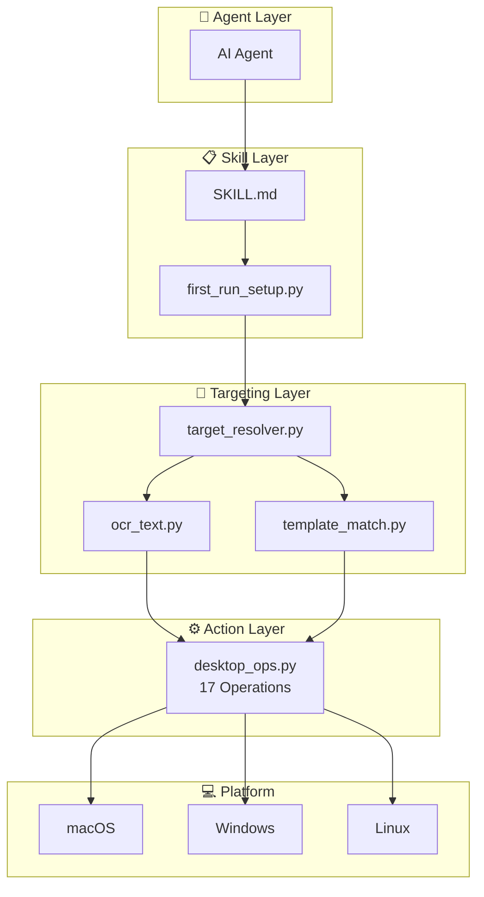
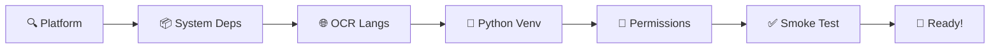

<div align="center">

# 🖥️ Desktop Agent Ops

**Cross-platform desktop GUI automation skill for AI agents**

[](https://opensource.org/licenses/MIT)
[](#-supported-platforms)
[](https://www.python.org)
[](https://github.com/appergb/desktop-agent-ops/releases)

**[English](README.md)** | **[中文](docs/README_zh.md)** | **[日本語](docs/README_ja.md)**

</div>

---

## 📖 What is Desktop Agent Ops?

Desktop Agent Ops is an **AI agent skill** that enables agents (Claude Code, Codex, GPT, etc.) to **see, understand, and interact with desktop applications** — just like a human sitting in front of a computer.

It provides a complete pipeline from **screen observation** to **precise clicking**, with built-in safeguards to prevent clicking the wrong element.

### Key Capabilities

| Capability | Description |
|-----------|-------------|
| 🔍 **Window-Scoped OCR** | OCR only scans the target app window — never clicks buttons in the wrong app |
| 🎯 **OCR-First Targeting** | Finds UI elements by text content, not blind coordinate guessing |
| 📐 **DPI-Aware** | Auto-detects Retina/HiDPI scaling on all platforms (1x, 1.5x, 2x, 3x) |
| 🌐 **Multi-Language OCR** | Auto-detects system language and installs matching Tesseract packs |
| ⌨️ **CJK Text Input** | Reliable Chinese/Japanese/Korean input via clipboard-paste fallback |
| 🔧 **One-Command Setup** | `first_run_setup.py` auto-installs everything on first use |
| 🖱️ **17 Operations** | Screenshot, click, type, scroll, drag, hotkey, focus-app, and more |

---

## 🏗️ Architecture



> 📄 [View full architecture diagram →](docs/architecture.md)

---

## 🎯 Targeting Pipeline

The core innovation: **always scope to the target app window before OCR**.

```
┌──────────────────────────────────────────────────────┐
│ Step 1: FOCUS target app                             │
│   desktop_ops.py focus-app --name "WeChat"           │
├──────────────────────────────────────────────────────┤
│ Step 2: GET window bounds                            │
│   → {x:100, y:50, width:800, height:600}             │
├──────────────────────────────────────────────────────┤
│ Step 3: CAPTURE only that window                     │
│   → screenshot contains ONLY the target app          │
├──────────────────────────────────────────────────────┤
│ Step 4: OCR within window (auto DPI scaling)         │
│   → finds "Send" at logical coordinates (450, 520)   │
├──────────────────────────────────────────────────────┤
│ Step 5: VERIFY target before clicking                │
│   → confirms coordinate is inside window bounds      │
├──────────────────────────────────────────────────────┤
│ Step 6: CLICK only if verified                       │
│   → click (450, 520) → verify UI changed             │
└──────────────────────────────────────────────────────┘
```

> 📄 [View full targeting sequence diagram →](docs/targeting-pipeline.md)

### Why Window-Scoped?

| Approach | Problem |
|----------|---------|
| ❌ Full-screen OCR | "Search" found in **both** WeChat and Chrome → clicks wrong app |
| ✅ Window-scoped OCR | "Search" found **only** in WeChat window → clicks correct element |

---

## ⚡ Quick Start

### As an AI Agent Skill

1. Copy `SKILL.md`, `scripts/`, and `references/` to your skill directory
2. The agent auto-runs `first_run_setup.py` on first use — **zero manual setup**

### Manual Usage

```bash
# One-command setup (installs EVERYTHING)
python3 scripts/first_run_setup.py

# Check readiness
python3 scripts/first_run_setup.py --check

# Get the venv python path from setup output
PY=$(python3 -c "import json; print(json.load(open('$HOME/.openclaw-desktop-agent-ops/setup_state.json'))['env']['DESKTOP_AGENT_OPS_PYTHON'])")
```

### Examples

```bash
# 📸 Take a screenshot
$PY scripts/desktop_ops.py screenshot --output screen.png

# 🔍 Find text in an app window (OCR-first, window-scoped)
$PY scripts/target_resolver.py --app "WeChat" --text "Send" --python $PY
# Returns: {best_candidate: {x: 450, y: 520, within_window: true}}

# 🖱️ Click at the found coordinates
$PY scripts/desktop_ops.py click --x 450 --y 520

# ⌨️ Type text (CJK supported via clipboard-paste)
$PY scripts/desktop_ops.py type --text "Hello World"

# 📜 Scroll within a specific window
$PY scripts/desktop_ops.py scroll --amount -5 --x 500 --y 400

# 🔑 Keyboard shortcut
$PY scripts/desktop_ops.py hotkey --keys cmd c
```

---

## 🔧 Auto-Setup Pipeline

`first_run_setup.py` handles **everything** in one command:



> 📄 [View full setup pipeline diagram →](docs/setup-pipeline.md)

| Stage | macOS | Windows | Linux |
|-------|-------|---------|-------|
| System deps | `brew install cliclick tesseract` | Guide: `choco install tesseract` | Guide: `apt install xdotool wmctrl tesseract-ocr` |
| OCR languages | Auto-detect locale → `brew install tesseract-lang` | Auto-detect via `locale.getdefaultlocale()` | Auto-detect via `LANG` env |
| Python venv | `uv venv` + `uv pip install` | Same | Same |
| Permissions | Screen Recording, Accessibility, Automation | N/A | N/A |
| Smoke test | screenshot + mouse move + pixel read | Same | Same (X11) |

---

## 💻 Supported Platforms

| Feature | macOS | Windows | Linux (X11) |
|---------|-------|---------|-------------|
| Screenshot | screencapture | pyautogui | pyautogui/scrot |
| Mouse/Keyboard | cliclick → pyautogui | pyautogui | pyautogui |
| Window focus | AppleScript | pygetwindow | wmctrl |
| Window bounds | AppleScript | pygetwindow | xdotool |
| App list | AppleScript | pygetwindow | wmctrl |
| OCR | pytesseract | pytesseract | pytesseract |
| CJK input | AppleScript paste | clip.exe + Ctrl+V | xclip + Ctrl+V |
| DPI detection | Auto (2x Retina) | Auto (1.25x-2x) | Auto (1x-2x) |
| Key fallback | AppleScript key code | pyautogui | pyautogui |

---

## 📁 Project Structure

```
desktop-agent-ops/
├── SKILL.md                    # Agent operating manual
├── README.md                   # English documentation (this file)
├── CHANGELOG.md                # Version history
├── LICENSE                     # MIT License
│
├── scripts/                    # Python scripts (3171 lines total)
│   ├── first_run_setup.py      # 🔧 One-command auto-setup
│   ├── desktop_ops.py          # ⚙️ 17 desktop operations
│   ├── target_resolver.py      # 🎯 OCR-first hybrid targeting
│   ├── ocr_text.py             # 🔍 Multi-lang OCR + DPI scaling
│   ├── permission_bootstrap.py # 🔐 OS permission requests
│   ├── click_and_verify.py     # ✅ Safe click with verification
│   ├── window_regions.py       # 📐 Semantic window regions
│   ├── target_report.py        # 📊 Structured targeting reports
│   ├── region_diff.py          # 🔄 Before/after image diff
│   ├── template_match.py       # 🖼️ OpenCV template matching
│   ├── smoke_test.py           # 🧪 Full readiness test
│   ├── doctor.py               # 🏥 Dependency health check
│   ├── task_context.py         # 📝 Per-task state management
│   ├── cleanup_task.py         # 🧹 Task cleanup
│   ├── platform_probe.py       # 🔎 OS and display detection
│   ├── targeting.py            # 📍 Candidate point generation
│   └── bootstrap_env.py        # 📦 Legacy venv setup
│
├── references/                 # Reference documentation
│   ├── workflow.md             # Core 8-step closed loop
│   ├── platform-macos.md       # macOS-specific guidance
│   ├── platform-windows.md     # Windows-specific guidance
│   ├── platform-linux.md       # Linux-specific guidance
│   ├── precise-targeting.md    # 5-layer precision targeting
│   ├── validation-patterns.md  # Two-stage verification
│   ├── chat-app-macos.md       # Chat app automation
│   ├── app-wechat-macos.md     # WeChat-specific guide
│   ├── operation-patterns.md   # Reusable task templates
│   └── ...                     # More reference docs
│
└── docs/                       # Diagrams and translations
    ├── README_zh.md            # 中文文档
    ├── README_ja.md            # 日本語ドキュメント
    ├── architecture.md         # Architecture diagram
    ├── targeting-pipeline.md   # Targeting sequence diagram
    └── setup-pipeline.md       # Setup pipeline diagram
```

---

## 📋 CLI Quick Reference

<details>
<summary><b>desktop_ops.py — 17 Desktop Operations</b></summary>

```bash
# Screenshot
$PY scripts/desktop_ops.py screenshot [--output PATH] [--with-cursor]
$PY scripts/desktop_ops.py capture-region --x X --y Y --width W --height H [--output PATH]

# App Management
$PY scripts/desktop_ops.py frontmost
$PY scripts/desktop_ops.py list-apps
$PY scripts/desktop_ops.py focus-app --name "App Name"
$PY scripts/desktop_ops.py front-window-bounds [--app "App Name"]

# Mouse
$PY scripts/desktop_ops.py move --x X --y Y [--duration SECONDS]
$PY scripts/desktop_ops.py click [--x X --y Y] [--button left|right|middle]
$PY scripts/desktop_ops.py double-click [--x X --y Y]
$PY scripts/desktop_ops.py drag --x1 X1 --y1 Y1 --x2 X2 --y2 Y2 [--duration SEC]
$PY scripts/desktop_ops.py scroll --amount N [--x X --y Y] [--direction vertical|horizontal]
$PY scripts/desktop_ops.py mouse-position

# Keyboard
$PY scripts/desktop_ops.py press --key KEY
$PY scripts/desktop_ops.py type --text "text to type"
$PY scripts/desktop_ops.py hotkey --keys cmd c

# Screen Info
$PY scripts/desktop_ops.py screen-size
$PY scripts/desktop_ops.py pixel-color --x X --y Y
```

</details>

<details>
<summary><b>target_resolver.py — OCR-First Element Targeting</b></summary>

```bash
# Find element by visible text (OCR)
$PY scripts/target_resolver.py --app "AppName" --text "button text" --python $PY

# Find by template image
$PY scripts/target_resolver.py --app "AppName" --template /path/to/icon.png --python $PY

# Narrow search to a window region
$PY scripts/target_resolver.py --app "AppName" --text "Search" --region-label top_search --python $PY
```

</details>

<details>
<summary><b>ocr_text.py — Multi-Language OCR with DPI Scaling</b></summary>

```bash
# OCR an app window (auto-detects language and DPI)
$PY scripts/ocr_text.py --app "AppName" --python $PY

# OCR from an image file
$PY scripts/ocr_text.py --image /path/to/screenshot.png --python $PY

# Force a specific language
$PY scripts/ocr_text.py --app "AppName" --lang "eng+jpn" --python $PY
```

</details>

<details>
<summary><b>first_run_setup.py — Auto Setup</b></summary>

```bash
python3 scripts/first_run_setup.py           # Full setup
python3 scripts/first_run_setup.py --check   # Check readiness only
python3 scripts/first_run_setup.py --force   # Force redo all stages
```

</details>

---

## 🔄 DPI / HiDPI / Retina Handling

All handled automatically. No manual configuration needed.

| Platform | Common Scales | Detection Method |
|----------|--------------|-----------------|
| macOS Retina | 2.0x | screenshot pixels ÷ logical screen bounds |
| macOS non-Retina | 1.0x | Same |
| Windows HiDPI | 1.25x, 1.5x, 2.0x | screenshot pixels ÷ pyautogui.size() |
| Linux X11 | 1.0x, 1.5x, 2.0x | screenshot pixels ÷ pyautogui.size() |

OCR output provides both coordinate systems:
- `box` → **logical coordinates** (use for mouse/click operations)
- `pixel_box` → raw pixel coordinates (for image analysis only)
- `dpi_scale` → detected scale factor

---

## 🌐 Multi-Language OCR Support

Auto-detected from system locale. No manual configuration required.

| System Language | Tesseract Pack | Auto-Installed |
|----------------|---------------|----------------|
| 简体中文 (zh-Hans) | chi_sim | ✅ |
| 繁體中文 (zh-Hant) | chi_tra | ✅ |
| 日本語 (ja) | jpn | ✅ |
| 한국어 (ko) | kor | ✅ |
| العربية (ar) | ara | ✅ |
| हिन्दी (hi) | hin | ✅ |
| Deutsch (de) | deu | ✅ |
| Français (fr) | fra | ✅ |
| Español (es) | spa | ✅ |
| English | eng | ✅ (always included) |

---

## 📄 License

[MIT License](LICENSE) — Free for commercial and personal use.

---

<div align="center">

**Made for AI agents that need to see and interact with desktop apps.**

[⬆ Back to top](#-desktop-agent-ops)

</div>
