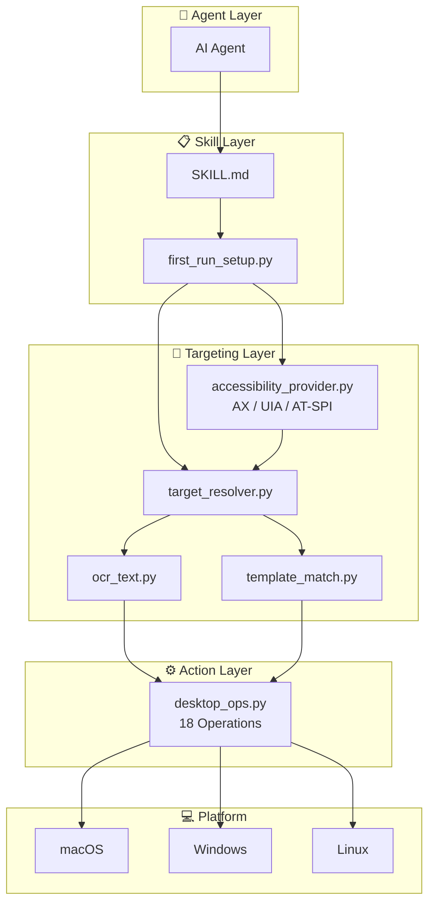
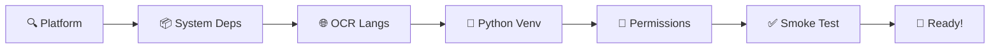

<div align="center">

# 🖥️ Desktop Agent Ops

**Cross-platform desktop GUI automation skill for AI agents**

[](https://opensource.org/licenses/MIT)
[](#-supported-platforms)
[](https://www.python.org)
[](https://github.com/appergb/desktop-agent-ops/releases)

**[English](README.md)** | **[中文](docs/README_zh.md)** | **[日本語](docs/README_ja.md)**

</div>

---

## 📖 What is Desktop Agent Ops?

Desktop Agent Ops is an **AI agent skill** that enables agents (Claude Code, Codex, GPT, etc.) to **see, understand, and interact with desktop applications** — just like a human sitting in front of a computer.

It provides a complete pipeline from **screen observation** to **precise clicking**, with built-in safeguards to prevent clicking the wrong element.

### Key Capabilities

| Capability | Description |
|-----------|-------------|
| 🔍 **Window-Scoped OCR** | OCR only scans the target app window — never clicks buttons in the wrong app |
| ♿ **Accessibility-First** | Uses structured accessibility trees first: macOS AXUIElement, Windows UI Automation, Linux AT-SPI |
| 🎯 **Smart Fallback OCR** | Falls back to Vision OCR / Tesseract when accessibility is sparse, blocked, or unavailable |
| 📐 **DPI-Aware** | Auto-detects Retina/HiDPI scaling on all platforms (1x, 1.5x, 2x, 3x) |
| 🌐 **Multi-Language OCR** | Auto-detects system language and installs matching Tesseract packs |
| ⌨️ **CJK Text Input** | Reliable Chinese/Japanese/Korean input via clipboard-paste fallback |
| 🔧 **One-Command Setup** | `first_run_setup.py` auto-installs everything on first use |
| 🖱️ **18 Operations** | Screenshot, click, type, insert-newline, scroll, drag, hotkey, focus-app, and more |
| 🔄 **Custom Workflows** | Define reusable multi-step automations in Markdown + YAML |
| 🔗 **Workflow Sharing** | Contribute workflows to community via GitHub PR |
| 🔐 **Secret Scanner** | Auto-detect hardcoded credentials before sharing |

---

## 🏗️ Architecture



> 📄 [View full architecture diagram →](docs/architecture.md)

---

## 🎯 Targeting Pipeline (Accessibility-First)

The core rule: **use a structured accessibility tree first, screenshot only when needed.**

```
┌──────────────────────────────────────────────────────────┐
│ Step 1: FOCUS target app                                  │
│   desktop_ops.py focus-app --name "WeChat"                │
├──────────────────────────────────────────────────────────┤
│ Step 2: TRY ACCESSIBILITY API (no screenshot needed)      │
│   accessibility_provider.py --app "WeChat" --text "Send"  │
│   → Returns structured JSON: {x, y, confidence: 1.0}     │
│   → ~34ms, ~200 tokens (vs 30,000-60,000 for screenshot) │
│   → If found: skip to Step 5                              │
├──────────────────────────────────────────────────────────┤
│ Step 3: FALLBACK — capture window (only if AX degraded)   │
│   → screenshot contains ONLY the target app               │
├──────────────────────────────────────────────────────────┤
│ Step 4: OCR within window (auto DPI scaling)              │
│   → finds "Send" at logical coordinates (450, 520)        │
├──────────────────────────────────────────────────────────┤
│ Step 5: VERIFY target before clicking                     │
│   → confirms coordinate is inside window bounds           │
├──────────────────────────────────────────────────────────┤
│ Step 6: CLICK only if verified                            │
│   → click (450, 520) → verify UI changed                  │
└──────────────────────────────────────────────────────────┘
```

> 📄 [View full targeting sequence diagram →](docs/targeting-pipeline.md)

### Why Window-Scoped?

| Approach | Problem |
|----------|---------|
| ❌ Full-screen OCR | "Search" found in **both** WeChat and Chrome → clicks wrong app |
| ✅ Window-scoped OCR | "Search" found **only** in WeChat window → clicks correct element |

---

## ⚡ Quick Start

### As an AI Agent Skill

1. Copy the `skill/` directory to your skill location (or install via ClawHub)
2. The agent auto-runs `first_run_setup.py` on first use — **zero manual setup**

### Manual Usage

```bash
# One-command setup (installs EVERYTHING)
python3 skill/scripts/first_run_setup.py

# Check readiness
python3 skill/scripts/first_run_setup.py --check

# Get the venv python path from setup output
PY=$(python3 -c "import json; print(json.load(open('$HOME/.openclaw-desktop-agent-ops/setup_state.json'))['env']['DESKTOP_AGENT_OPS_PYTHON'])")
```

### Examples

```bash
# 📸 Take a screenshot
$PY skill/scripts/desktop_ops.py screenshot --output screen.png

# 🔍 Find text in an app window (OCR-first, window-scoped)
$PY skill/scripts/target_resolver.py --app "WeChat" --text "Send" --python $PY
# Returns: {best_candidate: {x: 450, y: 520, within_window: true}}

# 🖱️ Click at the found coordinates
$PY skill/scripts/desktop_ops.py click --x 450 --y 520

# ⌨️ Type text (CJK supported via clipboard-paste)
$PY skill/scripts/desktop_ops.py type --text "Hello World"

# ↩️ Insert a literal newline without sending
$PY skill/scripts/desktop_ops.py insert-newline

# 📜 Scroll within a specific window
$PY skill/scripts/desktop_ops.py scroll --amount -5 --x 500 --y 400

# 🔑 Keyboard shortcut
$PY skill/scripts/desktop_ops.py hotkey --keys cmd c
```

---

## 🔄 Custom Workflows

Define reusable multi-step desktop automations as Markdown files with YAML frontmatter.

### Workflow Commands

```bash
# List available workflows
$PY skill/scripts/workflow_runner.py list

# Preview commands before execution (Agent reviews for safety)
$PY skill/scripts/workflow_runner.py preview --workflow "send-chat-message" \
  --param contact="John" --param message="Hello"

# Run a workflow
$PY skill/scripts/workflow_runner.py run --workflow "send-chat-message" \
  --param contact="John" --param message="Hello"

# Share a workflow to the community via GitHub PR
$PY skill/scripts/workflow_share.py share --workflow "my-workflow"
```

### Bundled Examples

| Workflow | Description |
|----------|-------------|
| `send-chat-message` | Send a message in WeChat/Slack/Teams |
| `browser-search` | Open browser and search for a query |
| `open-app-and-click` | Open an app and click a target element |

### Create Your Own

Save `.md` files to `~/.openclaw-desktop-agent-ops/workflows/`. See [Workflow Guide](skill/references/custom-workflows.md) for format details.

### Security

- **Agent Safety Review**: Before execution, the agent previews all commands and judges safety using its own reasoning — no hardcoded whitelist
- **Secret Scanner**: Before sharing, `secret_scanner.py` detects API keys, tokens, passwords, and personal paths. Error-level findings block upload

---

## 🔧 Auto-Setup Pipeline

`first_run_setup.py` handles **everything** in one command:



> 📄 [View full setup pipeline diagram →](docs/setup-pipeline.md)

| Stage | macOS | Windows | Linux |
|-------|-------|---------|-------|
| System deps | `brew install cliclick tesseract` | Guide: `choco install tesseract` | Guide: `apt install xdotool wmctrl tesseract-ocr` |
| OCR languages | Auto-detect locale → `brew install tesseract-lang` | Auto-detect via `locale.getdefaultlocale()` | Auto-detect via `LANG` env |
| Python venv | `uv venv` + `uv pip install` | Same | Same |
| Permissions | Screen Recording, Accessibility, Automation | Same privilege level as target app for best UIA results | AT-SPI session access; input varies by X11/Wayland |
| Smoke test | screenshot + mouse move + pixel read | Same | Same (X11) |

---

## 💻 Supported Platforms

| Feature | macOS | Windows | Linux |
|---------|-------|---------|-------------|
| Accessibility API | AXUIElement (native) | UI Automation (native) | AT-SPI (GNOME / `pyatspi`) |
| Screenshot | screencapture | pyautogui | pyautogui/scrot |
| Mouse | cliclick → pyautogui | pyautogui | pyautogui |
| Window focus | AppleScript | pygetwindow | wmctrl |
| Window bounds | AppleScript | pygetwindow | xdotool |
| App list | AppleScript | pygetwindow | wmctrl |
| OCR | pytesseract | pytesseract | pytesseract |
| Text input | Clipboard paste (all text) | Clipboard paste (PowerShell/clip) | Clipboard paste (xclip) |
| Key press | AppleScript key code → cliclick | pyautogui | pyautogui |
| Hotkey | cliclick (modifier+key) → pyautogui | pyautogui | pyautogui |
| DPI detection | Auto (2x Retina) | Auto (1.25x-2x) | Auto (1x-2x) |

---

## 📁 Project Structure

```
desktop-agent-ops/
├── README.md                          # English documentation (this file)
├── CHANGELOG.md                       # Version history
├── LICENSE                            # MIT License
├── THIRD_PARTY_NOTICES.md             # Dependency licenses
│
├── skill/                             # ← Skill package (what agents use)
│   ├── SKILL.md                       #   Agent operating manual
│   ├── desktop-agent-ops.md               #   Standard skill entry (accessibility-first, <200 lines)
│   ├── agents/                        #   Skill UI metadata (deprecated — openclaw only)
│   │   └── openai.yaml                #   Deprecated; Claude Code uses frontmatter
│   ├── workflows/                     #   Custom workflow definitions
│   │   └── examples/                  #   3 bundled example workflows
│   ├── scripts/                       #   Python scripts
│   │   ├── first_run_setup.py         #   🔧 One-command auto-setup
│   │   ├── accessibility_provider.py   #   ♿ Unified AX / UIA / AT-SPI entry
│   │   ├── ax_provider.py              #   ♿ macOS AX backend
│   │   ├── windows_uia_provider.py     #   🪟 Windows UI Automation backend
│   │   ├── linux_atspi_provider.py     #   🐧 Linux AT-SPI backend
│   │   ├── desktop_ops.py             #   ⚙️ 18 desktop operations
│   │   ├── target_resolver.py         #   🎯 Accessibility-first hybrid targeting
│   │   ├── ocr_text.py                #   🔍 Multi-lang OCR + DPI
│   │   ├── vision_ocr.py              #   👁️ Apple Vision / Google Vision OCR
│   │   ├── permission_bootstrap.py    #   🔐 OS permission requests
│   │   ├── click_and_verify.py        #   ✅ Safe click pipeline
│   │   ├── window_regions.py          #   📐 Semantic window regions
│   │   ├── target_report.py           #   📊 Targeting reports
│   │   ├── region_diff.py             #   🔄 Before/after diff
│   │   ├── template_match.py          #   🖼️ OpenCV matching
│   │   ├── smoke_test.py              #   🧪 Readiness test
│   │   ├── doctor.py                  #   🏥 Health check
│   │   ├── task_context.py            #   📝 Task state
│   │   ├── task_paths.py              #   🔒 Safe task path resolution
│   │   ├── cleanup_task.py            #   🧹 Cleanup
│   │   ├── platform_probe.py          #   🔎 OS detection
│   │   ├── window_kernel.py           #   🪟 Shared restore lifecycle
│   │   ├── window_backends.py         #   🧩 Platform window backends
│   │   ├── targeting.py               #   📍 Candidate points
│   │   ├── workflow_loader.py         #   🔄 Workflow discovery & parsing
│   │   ├── workflow_runner.py         #   🚀 Workflow execution engine
│   │   ├── secret_scanner.py          #   🔐 Sensitive info detection
│   │   └── workflow_share.py          #   🔗 Community sharing via PR
│   └── references/                    #   Reference documents
│       ├── workflow.md                #   Core 8-step loop
│       ├── custom-workflows.md        #   Workflow format guide
│       ├── platform-macos.md          #   macOS guidance
│       ├── platform-windows.md        #   Windows guidance
│       ├── platform-linux.md          #   Linux guidance
│       └── ...                        #   More reference docs
│
├── docs/                              # Documentation & translations
│   ├── README_zh.md                   # 中文文档
│   ├── README_ja.md                   # 日本語ドキュメント
│   ├── architecture.md                # Architecture diagram
│   ├── targeting-pipeline.md          # Targeting sequence diagram
│   └── setup-pipeline.md             # Setup pipeline diagram
│
└── tests/                             # Unit tests
    ├── test_geometry.py
    └── test_task_paths.py
```

---

## 📋 CLI Quick Reference

All commands below assume you are running from the repository root.

<details>
<summary><b>desktop_ops.py — 18 Desktop Operations</b></summary>

```bash
# Screenshot
$PY skill/scripts/desktop_ops.py screenshot [--output PATH] [--with-cursor]
$PY skill/scripts/desktop_ops.py capture-region --x X --y Y --width W --height H [--output PATH]

# App Management
$PY skill/scripts/desktop_ops.py frontmost
$PY skill/scripts/desktop_ops.py list-apps
$PY skill/scripts/desktop_ops.py focus-app --name "App Name"
$PY skill/scripts/desktop_ops.py front-window-bounds [--app "App Name"]

# Mouse
$PY skill/scripts/desktop_ops.py move --x X --y Y [--duration SECONDS]
$PY skill/scripts/desktop_ops.py click [--x X --y Y] [--button left|right|middle]
$PY skill/scripts/desktop_ops.py double-click [--x X --y Y]
$PY skill/scripts/desktop_ops.py drag --x1 X1 --y1 Y1 --x2 X2 --y2 Y2 [--duration SEC]
$PY skill/scripts/desktop_ops.py scroll --amount N [--x X --y Y] [--direction vertical|horizontal]
$PY skill/scripts/desktop_ops.py mouse-position

# Keyboard
$PY skill/scripts/desktop_ops.py press --key KEY
$PY skill/scripts/desktop_ops.py type --text "text to type"
$PY skill/scripts/desktop_ops.py insert-newline [--count N]
$PY skill/scripts/desktop_ops.py hotkey --keys cmd c

# Screen Info
$PY skill/scripts/desktop_ops.py screen-size
$PY skill/scripts/desktop_ops.py pixel-color --x X --y Y
```

</details>

<details>
<summary><b>target_resolver.py — Accessibility-First Element Targeting</b></summary>

```bash
# Accessibility API direct query (no screenshot, fastest)
$PY skill/scripts/accessibility_provider.py --app "AppName" --text "button text"

# Inspect full UI element tree
$PY skill/scripts/accessibility_provider.py --app "AppName" --elements

# Find element by visible text (OCR)
$PY skill/scripts/target_resolver.py --app "AppName" --text "button text" --python $PY

# Find by template image
$PY skill/scripts/target_resolver.py --app "AppName" --template /path/to/icon.png --python $PY

# Narrow search to a window region
$PY skill/scripts/target_resolver.py --app "AppName" --text "Search" --region-label top_search --python $PY
```

</details>

<details>
<summary><b>ocr_text.py — Multi-Language OCR with DPI Scaling</b></summary>

```bash
# OCR an app window (auto-detects language and DPI)
$PY skill/scripts/ocr_text.py --app "AppName" --python $PY

# OCR from an image file
$PY skill/scripts/ocr_text.py --image /path/to/screenshot.png --python $PY

# Force a specific language
$PY skill/scripts/ocr_text.py --app "AppName" --lang "eng+jpn" --python $PY
```

</details>

<details>
<summary><b>first_run_setup.py — Auto Setup</b></summary>

```bash
python3 skill/scripts/first_run_setup.py           # Full setup
python3 skill/scripts/first_run_setup.py --check   # Check readiness only
python3 skill/scripts/first_run_setup.py --force   # Force redo all stages
```

</details>

---

## 🔄 DPI / HiDPI / Retina Handling

All handled automatically. No manual configuration needed.

| Platform | Common Scales | Detection Method |
|----------|--------------|-----------------|
| macOS Retina | 2.0x | screenshot pixels ÷ logical screen bounds |
| macOS non-Retina | 1.0x | Same |
| Windows HiDPI | 1.25x, 1.5x, 2.0x | screenshot pixels ÷ pyautogui.size() |
| Linux X11 | 1.0x, 1.5x, 2.0x | screenshot pixels ÷ pyautogui.size() |

OCR output provides both coordinate systems:
- `box` → **logical coordinates** (use for mouse/click operations)
- `pixel_box` → raw pixel coordinates (for image analysis only)
- `dpi_scale` → detected scale factor

---

## 🌐 Multi-Language OCR Support

Auto-detected from system locale. No manual configuration required.

| System Language | Tesseract Pack | Auto-Installed |
|----------------|---------------|----------------|
| 简体中文 (zh-Hans) | chi_sim | ✅ |
| 繁體中文 (zh-Hant) | chi_tra | ✅ |
| 日本語 (ja) | jpn | ✅ |
| 한국어 (ko) | kor | ✅ |
| العربية (ar) | ara | ✅ |
| हिन्दी (hi) | hin | ✅ |
| Deutsch (de) | deu | ✅ |
| Français (fr) | fra | ✅ |
| Español (es) | spa | ✅ |
| English | eng | ✅ (always included) |

---

## 📄 License

[MIT License](LICENSE) — Free for commercial and personal use.

---

<div align="center">

**Made for AI agents that need to see and interact with desktop apps.**

[⬆ Back to top](#-desktop-agent-ops)

</div>
