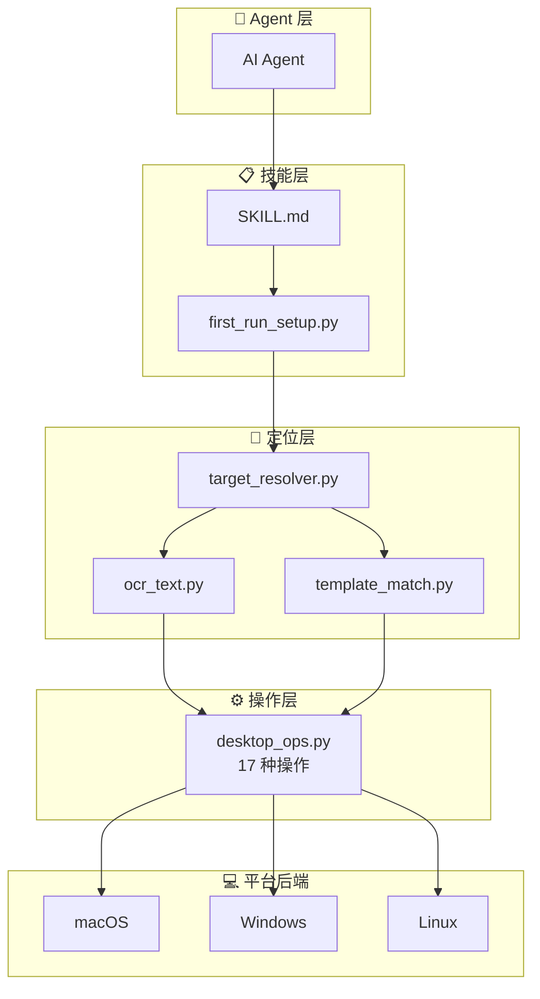

<div align="center">

# 🖥️ Desktop Agent Ops

**跨平台桌面 GUI 自动化技能，专为 AI Agent 设计**

[](https://opensource.org/licenses/MIT)
[](../README.md#-supported-platforms)
[](https://www.python.org)
[](https://github.com/appergb/desktop-agent-ops/releases)

**[English](../README.md)** | **[中文](README_zh.md)** | **[日本語](README_ja.md)**

</div>

---

## 📖 这是什么？

Desktop Agent Ops 是一个 **AI Agent 桌面自动化技能**，让 Claude Code、Codex、GPT 等 AI 能像人一样操作桌面应用 —— **看屏幕、找按钮、点击、打字、滚动**。

它提供了从**屏幕观察**到**精确点击**的完整管线，内置安全机制防止点错元素。

### 核心特点

| 特性 | 说明 |
|------|------|
| 🔍 **窗口隔离 OCR** | 只在目标应用窗口内做 OCR，绝不会误点其他应用的元素 |
| 🎯 **OCR 优先定位** | 通过文字内容找 UI 元素，不靠盲猜坐标 |
| 📐 **DPI 自适应** | 自动检测 Retina/高分屏缩放比（1x、1.5x、2x、3x） |
| 🌐 **多语言 OCR** | 自动检测系统语言，安装对应 Tesseract 语言包 |
| ⌨️ **中文输入** | 通过剪贴板粘贴方式可靠输入中日韩文字 |
| 🔧 **一键安装** | `first_run_setup.py` 首次使用时自动安装所有依赖 |
| 🖱️ **17 种操作** | 截图、点击、打字、滚动、拖拽、快捷键、聚焦应用等 |

---

## 🏗️ 架构



---

## 🎯 定位管线（6 步）

核心创新：**在 OCR 之前，始终锁定目标应用窗口。**

```
┌─────────────────────────────────────────────────┐
│ 第 1 步：聚焦目标应用                            │
│   desktop_ops.py focus-app --name "微信"          │
├─────────────────────────────────────────────────┤
│ 第 2 步：获取窗口边界                            │
│   → {x:100, y:50, width:800, height:600}         │
├─────────────────────────────────────────────────┤
│ 第 3 步：只截取窗口区域                          │
│   → 截图只包含目标应用                            │
├─────────────────────────────────────────────────┤
│ 第 4 步：窗口内 OCR（自动 DPI 缩放）             │
│   → 找到"发送"在逻辑坐标 (450, 520)              │
├─────────────────────────────────────────────────┤
│ 第 5 步：验证目标位置                            │
│   → 确认坐标在窗口范围内                          │
├─────────────────────────────────────────────────┤
│ 第 6 步：验证通过才点击                          │
│   → 点击 (450, 520) → 验证 UI 变化              │
└─────────────────────────────────────────────────┘
```

### 为什么要窗口隔离？

| 方式 | 问题 |
|------|------|
| ❌ 全屏 OCR | "搜索"在微信**和** Chrome 中都有 → 可能点错应用 |
| ✅ 窗口隔离 OCR | "搜索"**只**在微信窗口中查找 → 精确点击目标 |

---

## ⚡ 快速开始

### 作为 AI Agent 技能使用

1. 将 `SKILL.md`、`scripts/`、`references/` 复制到技能目录
2. Agent 首次使用时自动运行 `first_run_setup.py` —— **零手动配置**

### 手动安装使用

```bash
# 克隆仓库
git clone https://github.com/appergb/desktop-agent-ops.git
cd desktop-agent-ops

# 一键安装所有依赖（自动安装 cliclick、tesseract、OCR 语言包、Python 虚拟环境、申请系统权限）
python3 scripts/first_run_setup.py

# 检查是否就绪
python3 scripts/first_run_setup.py --check
```

### 使用示例

```bash
# 获取 venv python 路径
PY=$(python3 -c "import json; print(json.load(open('$HOME/.openclaw-desktop-agent-ops/setup_state.json'))['env']['DESKTOP_AGENT_OPS_PYTHON'])")

# 📸 截图
$PY scripts/desktop_ops.py screenshot --output screen.png

# 🔍 在应用窗口中找文字
$PY scripts/target_resolver.py --app "微信" --text "发送" --python $PY
# 返回: {best_candidate: {x: 450, y: 520, within_window: true}}

# 🖱️ 点击
$PY scripts/desktop_ops.py click --x 450 --y 520

# ⌨️ 输入文字（支持中文）
$PY scripts/desktop_ops.py type --text "你好世界"

# 📜 在指定窗口内滚动
$PY scripts/desktop_ops.py scroll --amount -5 --x 500 --y 400

# 🔑 快捷键
$PY scripts/desktop_ops.py hotkey --keys cmd c
```

---

## 🔧 自动安装管线

`first_run_setup.py` 一条命令搞定所有安装：


| 阶段 | macOS | Windows | Linux |
|------|-------|---------|-------|
| 系统依赖 | `brew install cliclick tesseract` | 提示: `choco install tesseract` | 提示: `apt install xdotool wmctrl tesseract-ocr` |
| OCR 语言包 | 自动检测系统语言 → 安装对应语言包 | 通过 `locale.getdefaultlocale()` 检测 | 通过 `LANG` 环境变量检测 |
| Python 环境 | `uv venv` + `uv pip install` | 同上 | 同上 |
| 系统权限 | 屏幕录制、辅助功能、自动化 | 无需 | 无需 |
| 冒烟测试 | 截图 + 鼠标移动 + 像素读取 | 同上 | 同上 (X11) |

---

## 💻 平台支持

| 功能 | macOS | Windows | Linux (X11) |
|------|-------|---------|-------------|
| 截图 | screencapture | pyautogui | pyautogui/scrot |
| 鼠标/键盘 | cliclick → pyautogui | pyautogui | pyautogui |
| 窗口聚焦 | AppleScript | pygetwindow | wmctrl |
| 窗口边界 | AppleScript | pygetwindow | xdotool |
| 应用列表 | AppleScript | pygetwindow | wmctrl |
| OCR | pytesseract | pytesseract | pytesseract |
| 中文输入 | AppleScript 粘贴 | clip.exe + Ctrl+V | xclip + Ctrl+V |
| DPI 检测 | 自动 (2x Retina) | 自动 (1.25x-2x) | 自动 (1x-2x) |

---

## 🌐 多语言 OCR 支持

根据系统语言自动检测，无需手动配置。

| 系统语言 | Tesseract 语言包 | 自动安装 |
|---------|-----------------|---------|
| 简体中文 | chi_sim | ✅ |
| 繁體中文 | chi_tra | ✅ |
| 日本語 | jpn | ✅ |
| 한국어 | kor | ✅ |
| العربية | ara | ✅ |
| Deutsch | deu | ✅ |
| Français | fra | ✅ |
| English | eng | ✅ (始终包含) |

---

## 📄 许可证

[MIT License](../LICENSE) — 可自由用于商业和个人项目。

---

<div align="center">

**为需要看见和操作桌面应用的 AI Agent 而生。**

[⬆ 回到顶部](#-desktop-agent-ops) | [English](../README.md)

</div>
