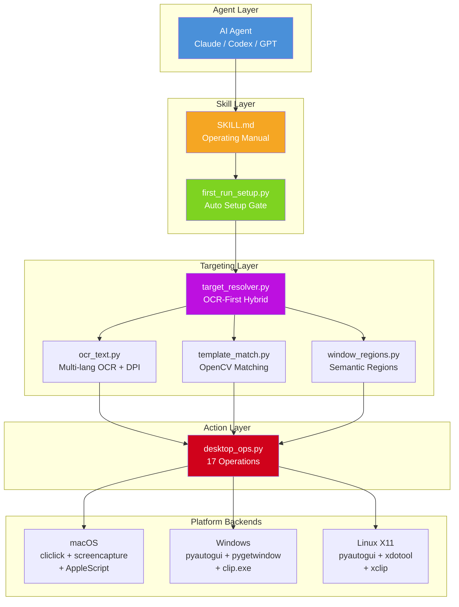

<!-- Architecture Diagram (rendered by GitHub Mermaid) -->
# Architecture

```mermaid
graph TB
    subgraph "Agent Layer"
        A[AI Agent<br/>Claude / Codex / GPT]
    end

    subgraph "Skill Layer"
        B[SKILL.md<br/>Operating Manual]
        C[first_run_setup.py<br/>Auto Setup Gate]
    end

    subgraph "Targeting Layer"
        D[target_resolver.py<br/>OCR-First Hybrid]
        E[ocr_text.py<br/>Multi-lang OCR + DPI]
        F[template_match.py<br/>OpenCV Matching]
        G[window_regions.py<br/>Semantic Regions]
    end

    subgraph "Action Layer"
        H[desktop_ops.py<br/>17 Operations]
    end

    subgraph "Platform Backends"
        I[macOS<br/>cliclick + screencapture<br/>+ AppleScript]
        J[Windows<br/>pyautogui + pygetwindow<br/>+ clip.exe]
        K[Linux X11<br/>pyautogui + xdotool<br/>+ xclip]
    end

    A --> B
    B --> C
    C --> D
    D --> E
    D --> F
    D --> G
    E --> H
    F --> H
    G --> H
    H --> I
    H --> J
    H --> K

    style A fill:#4A90D9,color:#fff
    style B fill:#F5A623,color:#fff
    style C fill:#7ED321,color:#fff
    style D fill:#BD10E0,color:#fff
    style H fill:#D0021B,color:#fff
```
