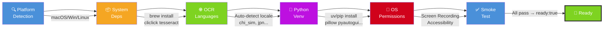

<!-- Setup Pipeline Diagram -->
# First-Run Setup Pipeline

```mermaid
flowchart LR
    A["🔍 Platform\nDetection"] --> B["📦 System\nDeps"]
    B --> C["🌐 OCR\nLanguages"]
    C --> D["🐍 Python\nVenv"]
    D --> E["🔐 OS\nPermissions"]
    E --> F["✅ Smoke\nTest"]

    A -->|macOS/Win/Linux| B
    B -->|"brew install\ncliclick tesseract"| C
    C -->|"Auto-detect locale\nchi_sim, jpn..."| D
    D -->|"uv/pip install\npillow pyautogui..."| E
    E -->|"Screen Recording\nAccessibility"| F
    F -->|"All pass → ready:true"| G["🚀 Ready"]

    style A fill:#4A90D9,color:#fff
    style B fill:#F5A623,color:#fff
    style C fill:#7ED321,color:#fff
    style D fill:#BD10E0,color:#fff
    style E fill:#D0021B,color:#fff
    style F fill:#4A90D9,color:#fff
    style G fill:#7ED321,color:#fff,stroke:#333,stroke-width:3px
```
