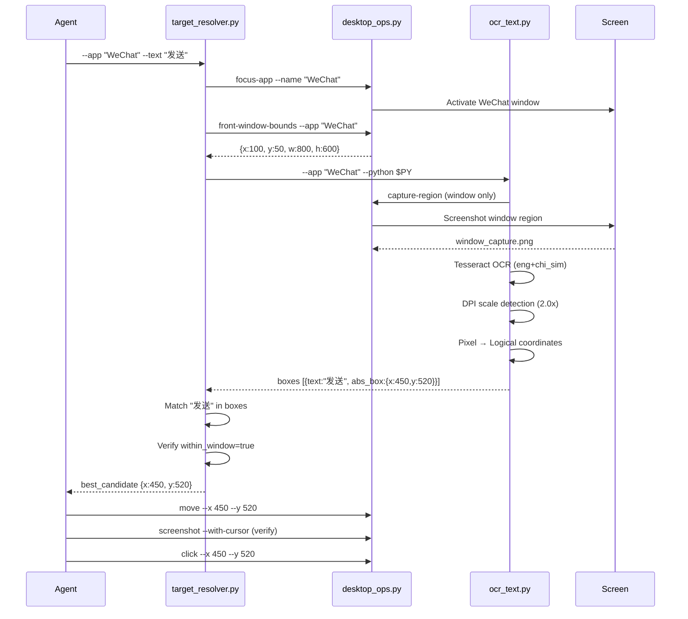

<!-- Targeting Pipeline Diagram -->
# Targeting Pipeline

```mermaid
sequenceDiagram
    participant Agent
    participant Resolver as target_resolver.py
    participant Ops as desktop_ops.py
    participant OCR as ocr_text.py
    participant Screen

    Agent->>Resolver: --app "WeChat" --text "发送"
    Resolver->>Ops: focus-app --name "WeChat"
    Ops->>Screen: Activate WeChat window
    Resolver->>Ops: front-window-bounds --app "WeChat"
    Ops-->>Resolver: {x:100, y:50, w:800, h:600}

    Resolver->>OCR: --app "WeChat" --python $PY
    OCR->>Ops: capture-region (window only)
    Ops->>Screen: Screenshot window region
    Screen-->>Ops: window_capture.png
    OCR->>OCR: Tesseract OCR (eng+chi_sim)
    OCR->>OCR: DPI scale detection (2.0x)
    OCR->>OCR: Pixel → Logical coordinates
    OCR-->>Resolver: boxes [{text:"发送", abs_box:{x:450,y:520}}]

    Resolver->>Resolver: Match "发送" in boxes
    Resolver->>Resolver: Verify within_window=true
    Resolver-->>Agent: best_candidate {x:450, y:520}

    Agent->>Ops: move --x 450 --y 520
    Agent->>Ops: screenshot --with-cursor (verify)
    Agent->>Ops: click --x 450 --y 520
```
